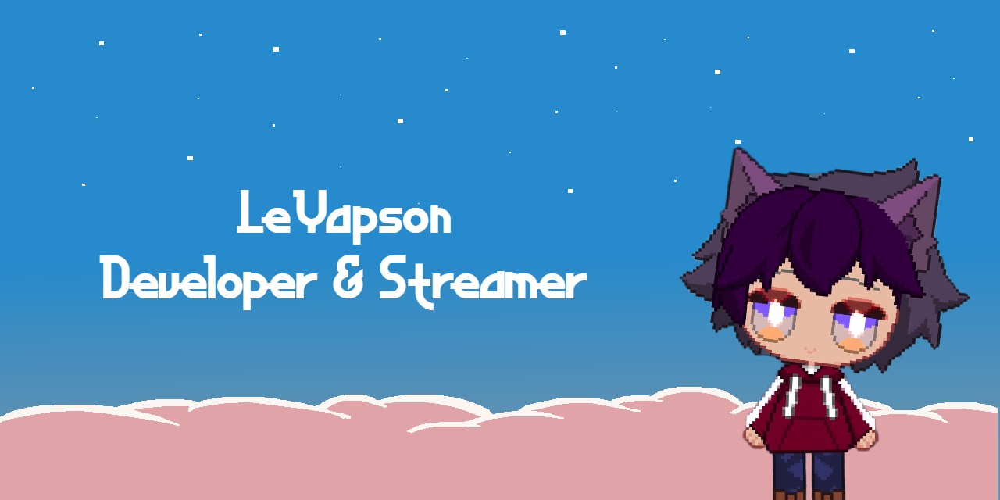

# 🌸 Théau Yapi (UwU) 🌸

---
<!-- FR -->

  
<strong>🇫🇷 Version Française</strong>

**Dev Enthusiast | Streamer**
*Passionné par le code, les jeux et les communautés créatives !*

---
## 🌟 À propos de moi
Je suis **Théau**, un développeur et streameur qui adore :
- Créer des projets (web, IoT, jeux vidéo)
- Animer des communautés (Twitch, Discord)
- Explorer des designs (pixel art, pastel, esthétique kawaii)

💡 **Fun fact** : J’adore le style pixel art et intégrer cette vibe dans tout ce que je fais !

---
## 💻 Mes compétences

| Domaine           | Technos/Outils                                  |
|-------------------|-------------------------------------------------|
| Développement     | JavaScript, React, Python, Git, C#              |
| Design            | Pixel art, esthétique pastel, overlays streams  |
| Streaming         | Gaming, coding en direct, formats détendus      |

---
## 🚀 Projets en cours

| Projet            | Description                                                                 | Statut          |
|-------------------|-----------------------------------------------------------------------------|-----------------|
| **Project MS**    | Jeu vidéo style JRPG japonais dans un style rétro.                          | 🛠️ En cours    |
| **Portfolio UwU** | Refonte de mon portfolio pour le défi *Back 2 School* (catégorie *UwU*).   | 🎨 En cours     |
| **The Stand**     | Création d'une association visant à organiser des rassemblements auto.     | 📅 En production|

---
## 🎮 Mes streams Twitch
📅 **Relance des streams le 7 octobre 2025** avec :
- **Gaming** (avec mon avatar VTube pixel art)
- **Coding** (développement en direct, tutoriels)
- **Formats canapé** (discussions, invités, thèmes variés)

🔗 **[Mon Twitch](https://www.titch.tv/yatokishi)**

---
## 🌈 Mes préférences
- **Design** : Pastel, pixel art, esthétique *kawaii* et *UwU*
- **Tech** : Solutions locales et projets IoT
- **Vibe** : Communautés bienveillantes et apprentissage collaboratif

---
## 📌 Mes réseaux
- **GitHub** : [LeYapson](https://github.com/LeYapson)
- **Twitch** : [yatokishi](https://www.twitch.tv/yatokishi)
- **Twitter** : [yatokishi](https://twitter.com/yatokishi)

---
## 💬 Un mot pour toi
> *"Le code, c’est comme un jeu : on apprend en s’amusant, et on partage avec les autres !"*

👉 **N’hésite pas à me contacter** pour collaborer ou discuter !

---
<!-- EN -->

  
<strong>🇬🇧 English Version</strong>

**Dev Enthusiast | Streamer**
*Passionate about coding, gaming, and creative communities!*

---
## 🌟 About Me
I'm **Théau**, a developer and streamer who loves:
- Creating projects (web, IoT, video games)
- Animating communities (Twitch, Discord)
- Exploring designs (pixel art, pastel, kawaii aesthetic)

💡 **Fun fact**: I love pixel art and integrating this vibe into everything I do!

---
## 💻 My Skills

| Domain            | Tools/Technologies                           |
|-------------------|----------------------------------------------|
| Development       | JavaScript, React, Python, Git, C#           |
| Design            | Pixel art, pastel aesthetic, stream overlays |
| Streaming         | Gaming, live coding, relaxed formats         |

---
## 🚀 Current Projects

| Project           | Description                                                                  | Status          |
|-------------------|------------------------------------------------------------------------------|-----------------|
| **Project MS**    | A retro-style JRPG video game.                                               | 🛠️ In progress  |
| **Portfolio UwU** | Redesigning my portfolio for the *Back 2 School* challenge (category *UwU*).| 🎨 In progress   |
| **The Stand**     | Creating an association to organize car meetups.                            | 📅 In production|

---
## 🎮 My Twitch Streams
📅 **Streams restarting on October 7, 2025** with:
- **Gaming** (with my pixel art VTube avatar)
- **Coding** (live development, tutorials)
- **Couch formats** (discussions, guests, various themes)

🔗 **[My Twitch](https://www.twitch.tv/yatokishi)**

---
## 🌈 My Preferences
- **Design**: Pastel, pixel art, *kawaii* and *UwU* aesthetic
- **Tech**: Local solutions and IoT projects
- **Vibe**: Welcoming communities and collaborative learning

---
## 📌 My Networks
- **GitHub**: [LeYapson](https://github.com/LeYapson)
- **Twitch**: [yatokishi](https://www.twitch.tv/yatokishi)
- **Twitter**: [yatokishi](https://twitter.com/yatokishi)

---
## 💬 A Word from Me
> *"Coding is like a game: you learn while having fun, and you share with others!"*

👉 **Feel free to reach out** to collaborate or chat!

---
## 📊 GitHub Stats

---
